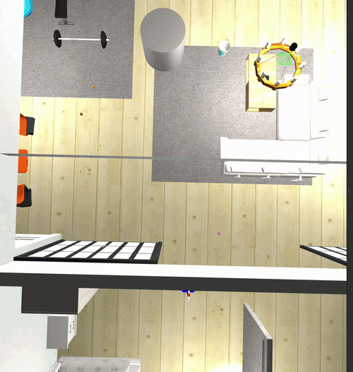
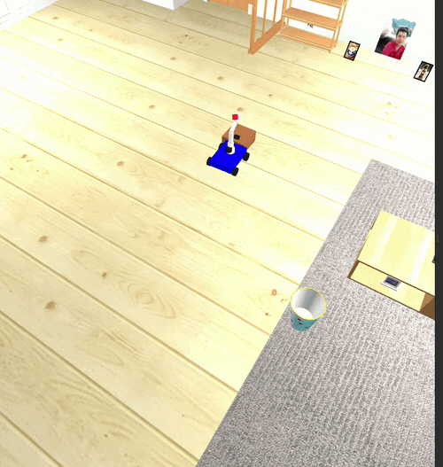

# mobile_arm_sim

Autonomous pick-and-place in Gazebo: a mobile base with a 4-joint arm searches the AWS RoboMaker small_house world for a 5 cm red block, picks it out from three lookalike distractor cubes, carries it across the house, and places it on a drop-off table. Nav2 + AMCL for navigation, an HSV detector with a size gate for perception, and a 5 Hz Python state machine running the mission. One launch file, one run command, no human input in between.

## Demo

An unmapped cylinder dropped into the carry path mid-run — it enters the local costmap from the LIDAR and the robot swings around it without losing the mission:



Docking against the table by touch and placing the block:



Full run (about 3 minutes): [demo video](https://drive.google.com/drive/folders/1ZerC9PO1Hz38izI8XHwdTFsy7ARdCJVM)

## How a mission runs

SEARCHING → APPROACHING → ALIGNING → GRASPING → CARRYING → PLACING → RETURNING, all non-blocking on a 5 Hz tick. The parts that took the most iterations to get right:

- The camera can only resolve the block out to about 1.1 m, so searching means driving a waypoint patrol and spinning at each stop, not looking around from the start pose.
- A detection made while the robot is turning can be off by over a meter (AMCL lags through rotations), so the robot stops and demands four sightings clustered within 0.2 m before it commits to a target.
- The final table approach ignores the pose estimate entirely: it creeps forward on odometry until a stall guard detects the bumper touching the table edge. Contact is repeatable; AMCL at ±0.1 m isn't, when the table is only 0.30 m across.

## Mapping

`slam_toolbox` running `online_async` while I teleop-drove every room:


Full house — 372×221 cells at 5 cm/pixel. 75% free, 3% walls, 22% unknown (the unknown is almost entirely outside the house footprint, plus a few LIDAR shadows under furniture).

## Gotchas found so far

- `gazebo_ros`'s `gzclient.launch.py` injects `libgazebo_ros_eol_gui.so`, which null-derefs an internal `Camera` shared_ptr and takes the GUI down on startup. Workaround in `launch/autonomous.launch.py` and `launch/mapping.launch.py`: include only `gzserver.launch.py` and spawn `gzclient` directly via `ExecuteProcess`.
- The AWS `small_house` package exports `GAZEBO_MODEL_PATH` in its `package.xml`, but the hook doesn't fire on `source install/setup.bash`. Launch file has to `SetEnvironmentVariable('GAZEBO_MODEL_PATH', ...)` explicitly or the world loads with pink models.
- `libgazebo_ros_camera` stacks `<namespace>` and `<camera_name>` when both are set — topics end up at `/camera/camera/image_raw` instead of `/camera/image_raw`. Setting `<namespace>/</namespace>` (single slash) inside the plugin's `<ros>` block fixes it.
- Anything computed from the map frame inherits AMCL's error. The carried block used to be positioned from the gripper pose looked up in `map`, and on a day AMCL settled 0.15 m off, every single placement missed the 0.30 m table. The pin and release are relative to the robot now — pure joint kinematics, localization can't touch them.
- A 5 cm block sits below the LIDAR plane, so navigation cannot see or avoid block-sized floor objects. Scene layout has to keep them out of the driving corridors; the first version of the scene had a distractor right in front of the spawn pose and the robot ran it over every launch.

## Running it

Autonomy scene (target block, distractors, drop-off table in the AWS house):
```
ros2 launch mobile_arm_sim autonomous.launch.py
# wait for Nav2 to come up:
ros2 lifecycle get /bt_navigator     # -> active [3]
# then start the mission:
ros2 run mobile_arm_sim autonomous_pick_place.py
```

Mapping (empty house, slam_toolbox online_async):
```
ros2 launch mobile_arm_sim mapping.launch.py
# separate terminal — teleop drive every room:
ros2 run teleop_twist_keyboard teleop_twist_keyboard
# when the map looks complete:
ros2 run nav2_map_server map_saver_cli -f src/mobile_arm_sim/maps/autonomous_map
```

Scripted baseline (the original demo the autonomy grew out of):
```
ros2 launch mobile_arm_sim pick_place.launch.py
ros2 run mobile_arm_sim pick_and_place.py
```

## Stack

ROS 2 Humble on Ubuntu 22.04. Gazebo Classic 11. `slam_toolbox` for mapping, Nav2 + AMCL at runtime. The base is driven by Gazebo's `planar_move` plugin (the wheels are cosmetic); arm and gripper via `ros2_control` `JointGroupPositionController`s — no MoveIt, the five fixed arm poses the mission needs don't justify a planning stack.
