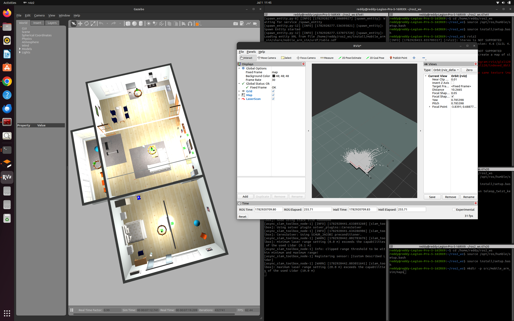
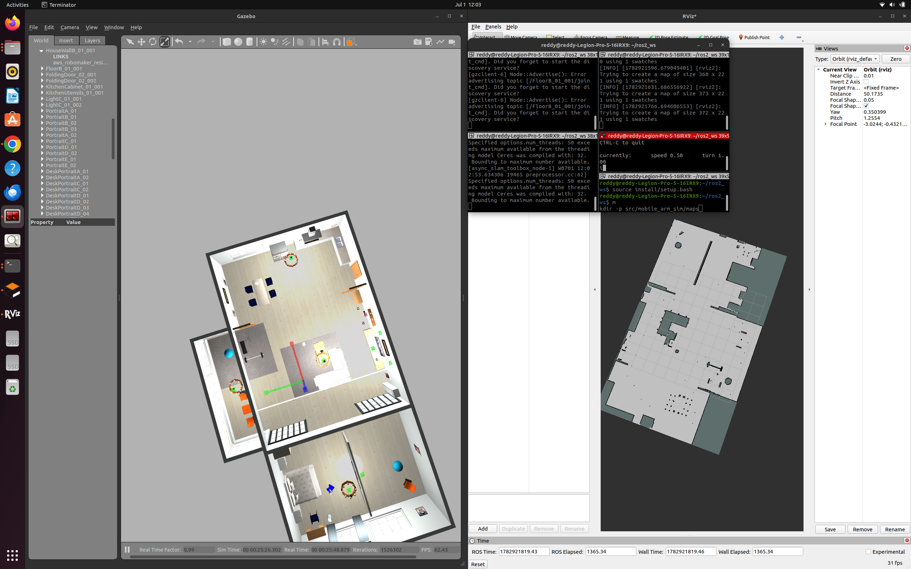

# mobile_arm_sim

Gazebo simulation of a holonomic mobile base with a 6-DoF arm, being converted from a scripted pick-and-place demo into an autonomous one — Nav2 for navigation, HSV block detection for perception, and a Python state machine on top. Runs in the AWS RoboMaker small_house world.

## Where this is right now

The scripted `pick_and_place.launch.py` demo is the baseline and still works. The autonomy rebuild is on top of it, in pieces:

- Camera (640×480, 30 Hz, ~1.2 rad HFOV) and planar LIDAR (360 samples, 10 m range, 10 Hz) mounted on the robot.
- AWS small_house world spawned with a red target block, 3 distractor cubes, and a drop-off table.
- Static occupancy map built with slam_toolbox for AMCL and Nav2 to use later.

Nav2 bringup, the HSV block detector, and the state-machine orchestrator are the remaining pieces.

## Mapping

`slam_toolbox` running `online_async` while I teleop-drove every room:



Empty grid, LIDAR just starting to sweep the first room.



Full house — 372×221 cells at 5 cm/pixel. 75% free, 3% walls, 22% unknown (the unknown is almost entirely outside the house footprint, plus a few LIDAR shadows under furniture).

## Gotchas found so far

- `gazebo_ros`'s `gzclient.launch.py` injects `libgazebo_ros_eol_gui.so`, which null-derefs an internal `Camera` shared_ptr and takes the GUI down on startup. Workaround in `launch/autonomous.launch.py` and `launch/mapping.launch.py`: include only `gzserver.launch.py` and spawn `gzclient` directly via `ExecuteProcess`.
- The AWS `small_house` package exports `GAZEBO_MODEL_PATH` in its `package.xml`, but the hook doesn't fire on `source install/setup.bash`. Launch file has to `SetEnvironmentVariable('GAZEBO_MODEL_PATH', ...)` explicitly or the world loads with pink models.
- `libgazebo_ros_camera` stacks `<namespace>` and `<camera_name>` when both are set — topics end up at `/camera/camera/image_raw` instead of `/camera/image_raw`. Setting `<namespace>/</namespace>` (single slash) inside the plugin's `<ros>` block fixes it.

## Running it

Autonomy scene (target block, distractors, drop-off table in the AWS house):
```
ros2 launch mobile_arm_sim autonomous.launch.py
```

Mapping (empty house, slam_toolbox online_async):
```
ros2 launch mobile_arm_sim mapping.launch.py
# separate terminal — teleop drive every room:
ros2 run teleop_twist_keyboard teleop_twist_keyboard
# when the map looks complete:
ros2 run nav2_map_server map_saver_cli -f src/mobile_arm_sim/maps/autonomous_map
```

Scripted baseline (still works):
```
ros2 launch mobile_arm_sim pick_place.launch.py
ros2 run mobile_arm_sim pick_and_place.py
```

## Stack

ROS 2 Humble on Ubuntu 22.04. Gazebo Classic 11. `slam_toolbox` for mapping. Arm control via `ros2_control` + `JointTrajectoryController` — no MoveIt.
